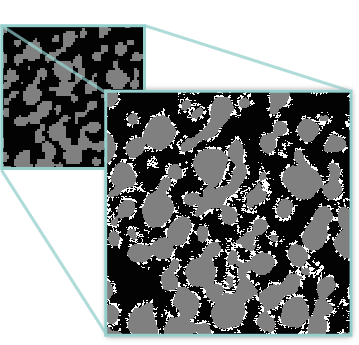

# SuperRes :telescope:



To understand the capabilities and theory behind SuperRes, please read our (currently under review) paper:

[Super-resolution of multiphase materials by combining complementary 2D and 3D image data using generative adversarial networks](https://arxiv.org/abs/2110.11281)

[](https://zenodo.org/badge/latestdoi/317877801)

## Overview

In very short, SuperRes requires (n >= m): 
- n-phase high-resolution 2D image.
- m-phase low-resolution 3D volume.

To produce an
- n-phase super-resolution 3D volume of the low-resolution 3D volume, with the fine characteristics and added features of the high-resolution 2D image. 


## Usage

### Training
To train the generator, simply run

```
python code/Architecture.py [options] 
```

with the following options:

Option | Type | Default | Description 
--- | --- | --- | ---
-d, --directory | str | 'default' | The name of the directory to save the generator in, under the 'progress' directory.
-sf, --scale_factor | float | 4 | The scale-factor between the high-res slice and low-res volume.
-g_image_path | str | 'nmc_wo_binder.tif' | Relative path to the low-res 3D volume inside [data](data).
-d_image_path | str | 'sem_image_stack.tif' | Relative path to the high-res 2D slice inside [data](data). If the material is anisotropic, 3 paths are needed in the correct order.
-phases_idx | int | [1, 2] | The indices of the phases of the low-res input to be compared with the super-res output.
--anisotropic | boolean - stores true | False | Use this option when the material is anisotropic.
--with_rotation | boolean - stores true | False | Use this option for data augmentaion (rotations and mirrors) of the high-res input.

More options are available in [code/LearnTools.py](code/LearnTools.py)

#### Training examples

To train the generator on isotropic material as in Figure 6 in the [paper](https://arxiv.org/abs/2110.11281), run:

```
python code/Architecture.py -d sem_isotropic --with_rotation -phases_idx 1 -sf 8 -g_image_path nmc_wo_bider.tif -d_image_path sem_image_stack.tif
```

To train the generator on anisotropic material as in Figure 3, run:

```
python code/Architecture.py -d separator_anisotropic --anisotropic -phases_idx 1 -sf 4 -g_image_path separator_lr_wo_fibrils.tif -d_image_path separator_rods_slices.tif separator_rods_slices.tif separator_speckles_slices.tif
```

### Evaluation
To evaluate and create the large super-resolution volume, run

```
python code/Evaluation.py [options]
```

With the same directory name chosen for training. Specify ```-volume_size_to_evaluate``` for the size of the low-res volume to be super-resolved. There is no need to specify ```--anisotropic``` here since only the generator is used. For example:

```
python code/Evaluation.py -d separator_anisotropic -volume_size_to_evaluate 156 75 75 -phases_idx 1 -g_image_path separator_lr_wo_fibrils.tif
```

## Development

If you are interested in trying new architectures and view the training outline, see the [code/Architecture.py](code/Architecture.py) file.

To try different CNNs in the GAN, see the [code/Networks.py](code/Networks.py) file.

To add a new preprocessing method e.g for a different training datatype, see [code/BatchMaker.py](code/BatchMaker.py).


