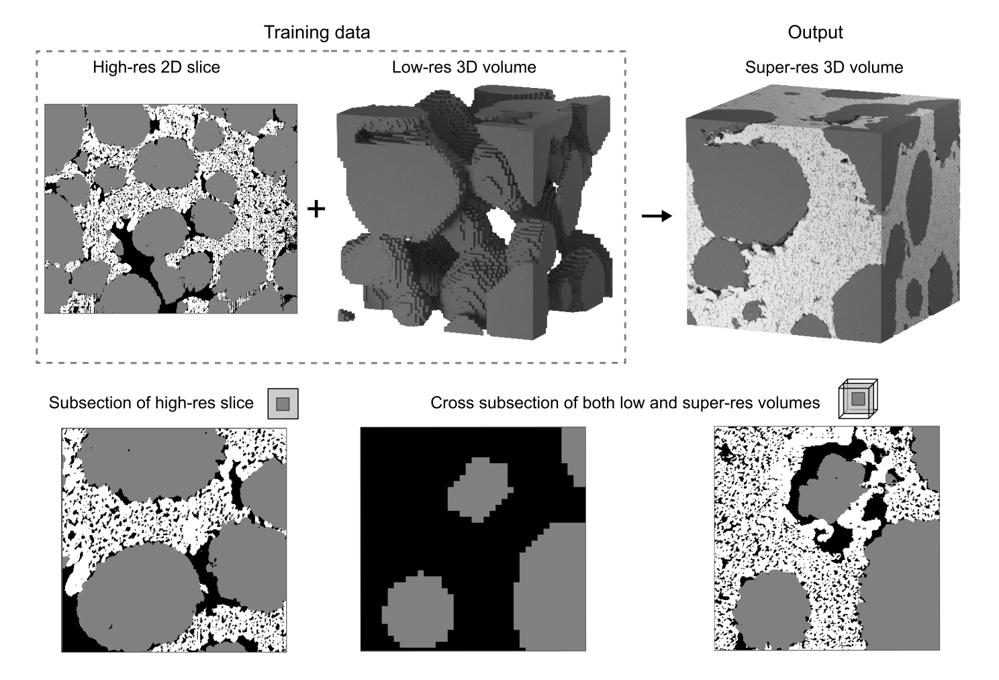

# SuperRes :telescope:

Fusion of complementary 2D and 3D mesostructural datasets using GANs


To understand the capabilities and theory behind the model, please read our paper:

[Fusion of complementary 2D and 3D mesostructural datasets using generative adversarial networks](https://onlinelibrary.wiley.com/doi/full/10.1002/aenm.202202407)

(Recently accepted for publication in Advanced Energy Materials!)

## Overview

SuperRes model combines image data with complementary attributes, to obtain image data with all of the following four properties to accurately model porous and/or composite materials:

1. Three dimensional (3D)
2. High resolution
3. Large field-of-view
4. Confidently differentiate between phases

- It is rarely possible to obtain image data with all four of these properties from a single imaging technique. 



In very short, SuperRes requires (n >= m): 
- n-phase high-resolution 2D image. 
- m-phase low-resolution 3D volume. 

To produce an
- n-phase super-resolution 3D volume of the low-resolution 3D volume, with the fine characteristics and added features of the high-resolution 2D image. 

## Setup and usage

We welcome contributions to SuperRes. Please [raise an issue](https://github.com/amirDahari1/SuperRes/issues) to report bugs, request features, or ask questions. 

### Setup

1. Install [git](https://git-scm.com/book/en/v2/Getting-Started-Installing-Git).
2. [Clone or Fork](https://docs.github.com/en/get-started/quickstart/fork-a-repo) the repository.

### Training

Store your 2D and 3D image training data inside the [data](data) folder.

To train the generator, simply run

```
python code/Architecture.py [options] 
```

with the following options:

Option | Type | Default | Description 
--- | --- | --- | ---
-d, --directory | str | 'default' | The name of the directory to save the generator in, under the 'progress' directory.
-sf, --scale_factor | float | 4 | The scale-factor between the high-res slice and low-res volume.
-g_image_path | str | 'nmc_wo_binder.tif' | Relative path to the low-res 3D volume inside [data](data).
-d_image_path | str | 'sem_image_stack.tif' | Relative path to the high-res 2D slice inside [data](data). If the material is anisotropic, 3 paths are needed in the correct order.
-phases_idx | int | [1, 2] | The indices of the phases of the low-res input to be compared with the super-res output.
--anisotropic | boolean - stores true | False | Use this option when the material is anisotropic.
--with_rotation | boolean - stores true | False | Use this option for data augmentaion (rotations and mirrors) of the high-res input.

More options are available in [code/LearnTools.py](code/LearnTools.py)

#### Training examples

We next outline how to train the model for the different case studies explored in the [paper](https://arxiv.org/abs/2110.11281).

##### Case study 1 (validation)

To train the model on an isotropic material with abundant training data (Battery cathode), run:

```
python code/Architecture.py -d NMC_case_study_1 --with_rotation -phases_idx 1 -sf 4 -g_image_path NMC_lr_input.tif -d_image_path NMC_hr_input.tif
```

##### Case study 2 (validation)

To train the model on an anisotropic material with limited training data (Battery separator), run:

```
python code/Architecture.py -d Separator_case_study_2 --separator --anisotropic -phases_idx 1 -sf 4 -g_image_path Separator_lr_input.tif -d_image_path Separator_hr_input_rods.tif Separator_hr_input_rods.tif Separator_hr_input_speckles.tif
```

##### Case study 3 (validation)

To highlight an alternative operational mode of the algorithm, the low-res data in this case is undersampled, rather than underresolved. 
To train the model on an isotropic material with abundant training data (Fuel cell anode), run: 

```
python code/Architecture.py -d SOFC_case_study_3 --super_sampling --with_rotation -phases_idx 1 2 -sf 4 -g_image_path SOFC_lr_input.tif -d_image_path SOFC_hr_input.tif
```

##### Case study 4 (demonstration - ground truth is not known)
To train the model on an isotropic marterial with limited training data (Battery cathode), run:

```
python code/Architecture.py -d SEM_case_study_4 --with_rotation -phases_idx 1 -sf 8 -g_image_path SEM_lr_input.tif -d_image_path SEM_hr_input.tif
```

### Evaluation
To evaluate and create the large super-resolution volume, run

```
python code/Evaluation.py [options]
```

With the same directory name chosen for training. Specify ```-volume_size_to_evaluate``` for the size of the low-res volume to be super-resolved. There is no need to specify ```--anisotropic``` or ```with_rotation``` here since only the generator is used. The appropriate evaluation codes for the explored case studies are:

> Some generators are saved along training with epoch numbers. To use a specific generator with an epoch number XXXX, add the flag -g_epoch_id XXXX 

##### Case study 1 (validation)
```
python code/Evaluation.py -d NMC_case_study_1 -phases_idx 1 -sf 4 -volume_size_to_evaluate 128 128 128 -g_image_path NMC_lr_input.tif
```

##### Case study 2 (validation)
```
python code/Evaluation.py -d Separator_case_study_2 -phases_idx 1 -sf 4 -volume_size_to_evaluate 156 75 75 -g_image_path Separator_lr_input.tif
```

##### Case study 3 (validation)
```
python code/Evaluation.py -d SOFC_case_study_3 --super_sampling -sf 4 -volume_size_to_evaluate 62 62 62 -phases_idx 1 2 -g_image_path SOFC_lr_input.tif 
```

##### Case study 4 (demonstration - ground truth is not known)
```
python code/Evaluation.py -d SEM_case_study_4 -sf 8 -phases_idx 1 -volume_size_to_evaluate 128 128 128 -g_image_path SEM_lr_input.tif 
```


## Development

If you are interested in trying new architectures and view the training outline, see the [code/Architecture.py](code/Architecture.py) file.

To try different CNNs in the GAN, see the [code/Networks.py](code/Networks.py) file.

To add a new preprocessing method e.g for a different training datatype, see [code/BatchMaker.py](code/BatchMaker.py).

## Code and Data

[](https://zenodo.org/badge/latestdoi/317877801)

[A Super-Res generated volume for each model trained in the 4 explored case studies, plus all data used for training.](https://zenodo.org/record/7104555#.Y0V8TtJByGZ)

